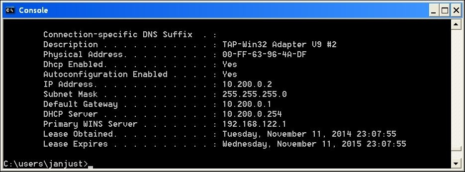
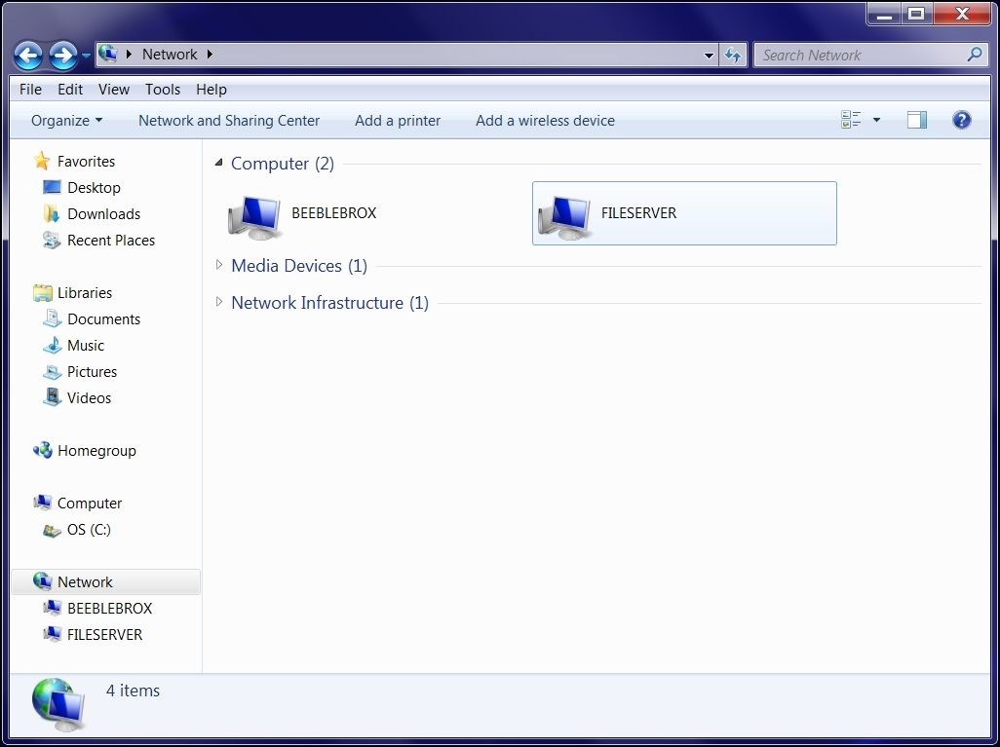

# Глава 5. Расширенные сценарии развертывания в туннельном режиме

Базовая конфигурация VPN относительно проста, но интеграция этого VPN с остальной частью сети является гораздо более сложной задачей. В этой главе мы рассмотрим некоторые расширенные сценарии развертывания OpenVPN, которые выходят за рамки базовой установки и настройки VPN. Некоторые из этих сценариев основаны на реальных вопросах пользователей из списков рассылки OpenVPN, форума и канала IRC. Мы рассмотрим следующие темы:

* Включение (Windows) общего доступа к файлам через VPN
* Интеграция с механизмами внутренней аутентификации, такими как PAM и LDAP
* Фильтрация VPN-трафика (межсетевой экран)
* Маршрутизация на основе политик для повышения безопасности
* Работа с общими и частными сетевыми адаптерами в Windows 7 Использование OpenVPN с прокси HTTP или SOCKS

Примеры, представленные в этой главе, основаны на примерах из предыдущей главы, [Глава 4](chapter-04.md), _Режим клиент/сервер с устройствами tun_. В частности, будут использоваться базовые файлы конфигурации производственного уровня и добавление дополнительных разделов безопасности.

## Включение общего доступа к файлам через VPN

Как указано в разделе _Маршрутизация и маршрутизация на стороне сервера_ в предыдущей главе, VPN действительно полезен только тогда, когда клиенты VPN имеют доступ к ресурсам на стороне сервера. Для доступа к этим серверным ресурсам необходима маршрутизация. Это обеспечивает правильный поток сетевого трафика между серверной локальной сетью и VPN.

Одним из наиболее распространенных вариантов использования VPN является предоставление удаленным работникам доступа к ресурсам в корпоративной сети. Файлы в корпоративной сети часто хранятся на файловом сервере под управлением Windows. Для просмотра общих файловых ресурсов Windows с использованием сетевых имен потребуется сервер WINS.

Опять же, очень распространенная схема доступа к ресурсам в сети на стороне сервера изображена здесь:


Локальная сеть на стороне сервера - **192.168.122.0/24**, и в этой подсети расположены ресурсы, к которым VPN-клиенты должны получить доступ.

Мы начнем с файла `basic-udp-server.conf` и добавим три строки:

```
proto udp
port 1194
dev tun
server 10.200.0.0 255.255.255.0
topology subnet
persist-key
persist-tunkeepalive 10 60

remote-cert-tls client
tls-auth  /etc/openvpn/movpn/ta.key 0
dh        /etc/openvpn/movpn/dh2048.pem
ca        /etc/openvpn/movpn/movpn-ca.crt
cert      /etc/openvpn/movpn/server.crt
key       /etc/openvpn/movpn/server.key

user nobody
group nobody # use 'group nogroup' on Debian/Ubuntu

verb 3
daemon
log-append /var/log/openvpn.log

push "route 192.168.122.0 255.255.255.0"
push "redirect-gateway"
push "dhcp-option WINS 192.168.122.1"
```

Сохраните этот файл как `movpn-05-01-server.conf`.

Первая дополнительная строка добавляет серверную локальную сеть в набор сетей, которые необходимо маршрутизировать через VPN. Вторая строка перенаправляет весь сетевой трафик через VPN-туннель. Эта строка необходима, чтобы гарантировать, что адаптер OpenVPN TAP-Win считается закрытым. Общий доступ к файлам возможен только при использовании приватных сетевых адаптеров (в отличие от общедоступных сетевых адаптеров). Последняя дополнительная строка указывает серверу OpenVPN передать дополнительную опцию DHCP клиенту OpenVPN, содержащую IP-адрес сервера WINS.

Мы запускаем сервер OpenVPN, используя этот файл конфигурации. Мы снова используем машину на базе Windows 7 Professional 64 бит в качестве клиента OpenVPN, на которой установлена версия OpenVPN 2.3.5-I001 X86_64.

Запустите приложение OpenVPN GUI, выберите конфигурацию **basic-udp-client** и нажмите **Connect**.


Как мы делали в примере в разделе _Маршрутизация и маршрутизация на стороне сервера_ в предыдущей главе, мы гарантируем, что сервер OpenVPN пересылает IP-трафик и что на шлюзе на стороне сервера добавлен дополнительный маршрут для правильной маршрутизации VPN-трафика обратно через VPN-сервер.

После того, как было установлено соединение VPN, мы переходим к **Network and Sharing Center** чтобы убедиться что адаптер TAP (названный `vpn0` в следующем скриншоте) отмечен как непубличный и является частью либо **Home** или **Work** сети/группы/места/. Если адаптер TAP помечен как **общедоступный** - это означает, что Windows не доверяет трафику, поступающему от этого адаптера и будет отказывать в обмене файлами через VPN. В разделе этой главы _Сетевые расположения Windows - общие и частные_, мы подробно рассмотрим эту тему.


Как мы видим, соединение OpenVPN `vpn0` является частью сети **Work** - это означает что общий доступ к файлам разрешен.

Первый способ проверить, работает ли общий доступ к файлам - это перейти к файловому серверу, используя его IP-адрес. Вы можете сделать это, открыв окно командной строки и введя следующие строки:

```
C:> start \\192.168.122.1
```

На этом этапе появится диалоговое окно аутентификации.

Введите свои учетные данные для файлового сервера. Теперь откроется окно проводника Windows с содержимым удаленных общих ресурсов.

### Использование имен NetBIOS

Вместо просмотра файловых ресурсов по их IP-адресам гораздо удобнее использовать сетевое имя файлового сервера Windows. Для этого клиенту Windows необходим адрес сервера WINS. Строка `push "dhcp-option WINS 192.168.122.1"` передает этот адрес WINS для всех подключающихся клиентов OpenVPN. После того, как VPN-соединение установлено, мы можем проверить, используется ли соответствующий WINS-сервер, введя команду `ipconfig /all` в командной оболочке.



IP-адрес сервера WINS указан в строке **Primary WINS Server (Основной сервер WINS)**, которая указывает, что Windows будет использовать этот сервер для разрешения имен WINS.

Теперь, когда **Network and Sharing Center (Центр управления сетями и общим доступом)** открыт, файловый сервер будет отображаться с именем NetBIOS (`FILESERVER`):



Когда мы нажмем на этот значок, то увидим доступные общие ресурсы на файловом сервере:


Когда мы снова нажмем на общий ресурс, появляется диалоговое окно аутентификации. Введите свои учетные данные для файлового сервера. Откроется окно проводника Windows с содержимым удаленного общего ресурса как при использовании IP-адреса.

### Использование nbtstat для устранения проблем с подключением

Средство командной строки Windows **nbtstat** очень полезно при устранении проблем с совместным использованием файлов Windows. Вы можете найти имя Windows NetBIOS и просмотреть доступные общие ресурсы или найти имя NetBIOS, которое соответствует определенному IP-адресу. В обоих случаях вывод будет примерно таким:


