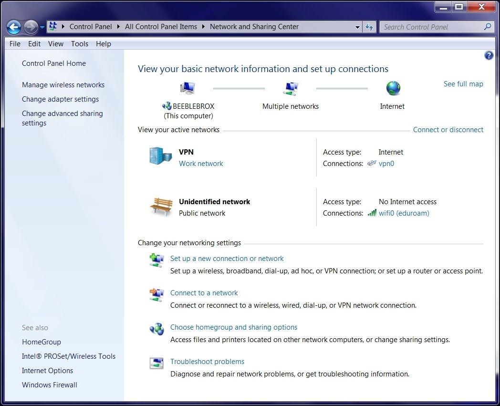
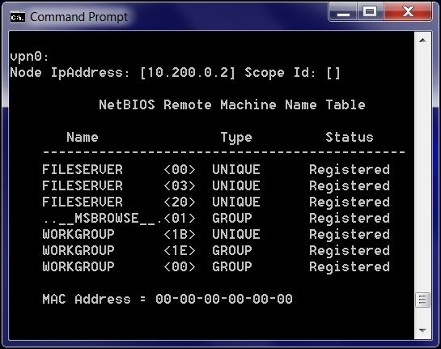
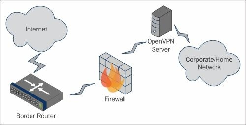
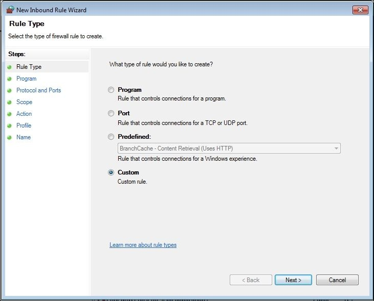
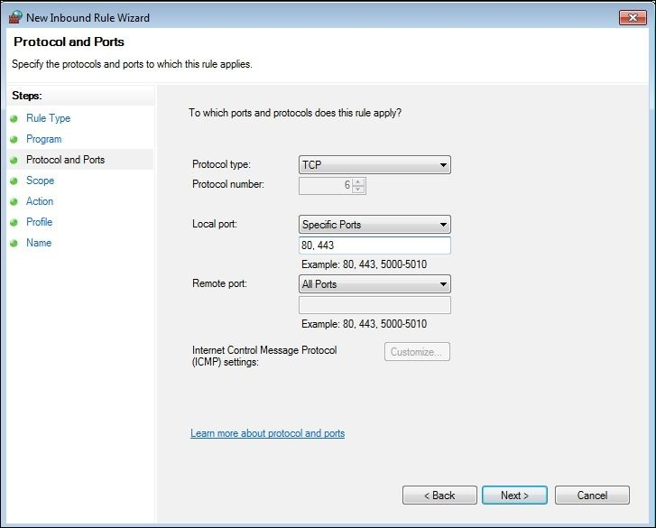
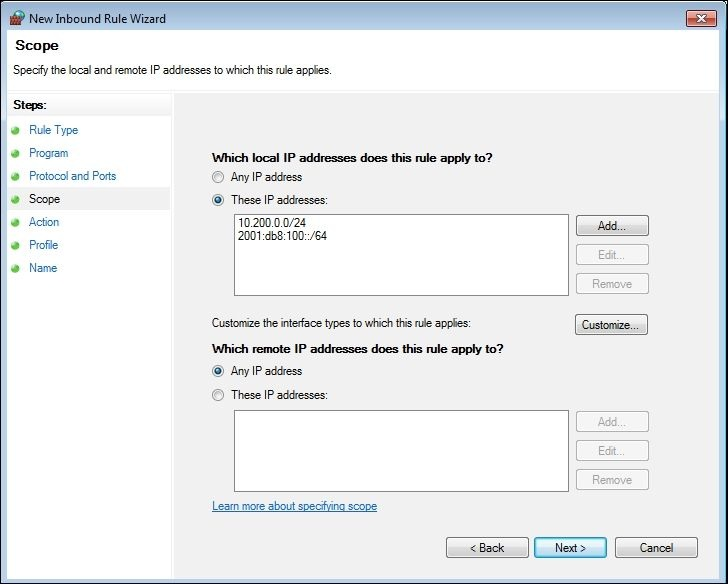
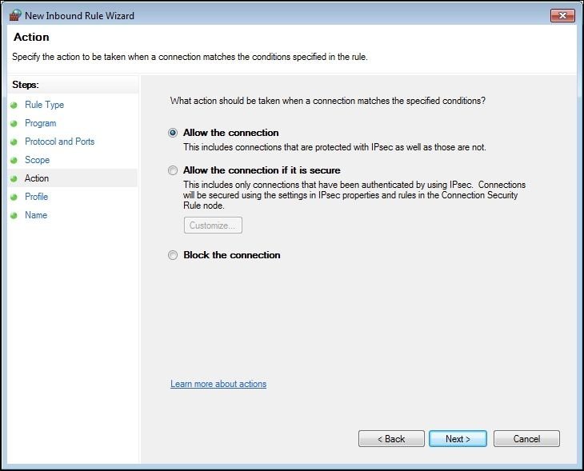

# Глава 5. Расширенные сценарии развертывания в туннельном режиме

Базовая конфигурация VPN относительно проста, но интеграция этого VPN с остальной частью сети является гораздо более сложной задачей. В этой главе мы рассмотрим некоторые расширенные сценарии развертывания OpenVPN, которые выходят за рамки базовой установки и настройки VPN. Некоторые из этих сценариев основаны на реальных вопросах пользователей из списков рассылки OpenVPN, форума и канала IRC. Мы рассмотрим следующие темы:

* Включение (Windows) общего доступа к файлам через VPN
* Интеграция с механизмами внутренней аутентификации, такими как PAM и LDAP
* Фильтрация VPN-трафика (межсетевой экран)
* Маршрутизация на основе политик для повышения безопасности
* Работа с общими и частными сетевыми адаптерами в Windows 7 Использование OpenVPN с прокси HTTP или SOCKS

Примеры, представленные в этой главе, основаны на примерах из предыдущей главы, [Глава 4](chapter-04.md), _Режим клиент/сервер с устройствами tun_. В частности, будут использоваться базовые файлы конфигурации производственного уровня и добавление дополнительных разделов безопасности.

## Включение общего доступа к файлам через VPN

Как указано в разделе _Маршрутизация и маршрутизация на стороне сервера_ в предыдущей главе, VPN действительно полезен только тогда, когда клиенты VPN имеют доступ к ресурсам на стороне сервера. Для доступа к этим серверным ресурсам необходима маршрутизация. Это обеспечивает правильный поток сетевого трафика между серверной локальной сетью и VPN.

Одним из наиболее распространенных вариантов использования VPN является предоставление удаленным работникам доступа к ресурсам в корпоративной сети. Файлы в корпоративной сети часто хранятся на файловом сервере под управлением Windows. Для просмотра общих файловых ресурсов Windows с использованием сетевых имен потребуется сервер WINS.

Опять же, очень распространенная схема доступа к ресурсам в сети на стороне сервера изображена здесь:


Локальная сеть на стороне сервера - **192.168.122.0/24**, и в этой подсети расположены ресурсы, к которым VPN-клиенты должны получить доступ.

Мы начнем с файла `basic-udp-server.conf` и добавим три строки:

```
proto udp
port 1194
dev tun
server 10.200.0.0 255.255.255.0
topology subnet
persist-key
persist-tunkeepalive 10 60

remote-cert-tls client
tls-auth  /etc/openvpn/movpn/ta.key 0
dh        /etc/openvpn/movpn/dh2048.pem
ca        /etc/openvpn/movpn/movpn-ca.crt
cert      /etc/openvpn/movpn/server.crt
key       /etc/openvpn/movpn/server.key

user nobody
group nobody # use 'group nogroup' on Debian/Ubuntu

verb 3
daemon
log-append /var/log/openvpn.log

push "route 192.168.122.0 255.255.255.0"
push "redirect-gateway"
push "dhcp-option WINS 192.168.122.1"
```

Сохраните этот файл как `movpn-05-01-server.conf`.

Первая дополнительная строка добавляет серверную локальную сеть в набор сетей, которые необходимо маршрутизировать через VPN. Вторая строка перенаправляет весь сетевой трафик через VPN-туннель. Эта строка необходима, чтобы гарантировать, что адаптер OpenVPN TAP-Win считается закрытым. Общий доступ к файлам возможен только при использовании приватных сетевых адаптеров (в отличие от общедоступных сетевых адаптеров). Последняя дополнительная строка указывает серверу OpenVPN передать дополнительную опцию DHCP клиенту OpenVPN, содержащую IP-адрес сервера WINS.

Мы запускаем сервер OpenVPN, используя этот файл конфигурации. Мы снова используем машину на базе Windows 7 Professional 64 бит в качестве клиента OpenVPN, на которой установлена версия OpenVPN 2.3.5-I001 X86_64.

Запустите приложение OpenVPN GUI, выберите конфигурацию **basic-udp-client** и нажмите **Connect**.


Как мы делали в примере в разделе _Маршрутизация и маршрутизация на стороне сервера_ в предыдущей главе, мы гарантируем, что сервер OpenVPN пересылает IP-трафик и что на шлюзе на стороне сервера добавлен дополнительный маршрут для правильной маршрутизации VPN-трафика обратно через VPN-сервер.

После того, как было установлено соединение VPN, мы переходим к **Network and Sharing Center** чтобы убедиться что адаптер TAP (названный `vpn0` в следующем скриншоте) отмечен как непубличный и является частью либо **Home** или **Work** сети/группы/места/. Если адаптер TAP помечен как **общедоступный** - это означает, что Windows не доверяет трафику, поступающему от этого адаптера и будет отказывать в обмене файлами через VPN. В разделе этой главы _Сетевые расположения Windows - общие и частные_, мы подробно рассмотрим эту тему.



Как мы видим, соединение OpenVPN `vpn0` является частью сети **Work** - это означает что общий доступ к файлам разрешен.

Первый способ проверить, работает ли общий доступ к файлам - это перейти к файловому серверу, используя его IP-адрес. Вы можете сделать это, открыв окно командной строки и введя следующие строки:

```
C:> start \\192.168.122.1
```

На этом этапе появится диалоговое окно аутентификации.

Введите свои учетные данные для файлового сервера. Теперь откроется окно проводника Windows с содержимым удаленных общих ресурсов.

### Использование имен NetBIOS

Вместо просмотра файловых ресурсов по их IP-адресам гораздо удобнее использовать сетевое имя файлового сервера Windows. Для этого клиенту Windows необходим адрес сервера WINS. Строка `push "dhcp-option WINS 192.168.122.1"` передает этот адрес WINS для всех подключающихся клиентов OpenVPN. После того, как VPN-соединение установлено, мы можем проверить, используется ли соответствующий WINS-сервер, введя команду `ipconfig /all` в командной оболочке.


IP-адрес сервера WINS указан в строке **Primary WINS Server (Основной сервер WINS)**, которая указывает, что Windows будет использовать этот сервер для разрешения имен WINS.

Теперь, когда **Network and Sharing Center (Центр управления сетями и общим доступом)** открыт, файловый сервер будет отображаться с именем NetBIOS (`FILESERVER`):


Когда мы нажмем на этот значок, то увидим доступные общие ресурсы на файловом сервере:


Когда мы снова нажмем на общий ресурс, появляется диалоговое окно аутентификации. Введите свои учетные данные для файлового сервера. Откроется окно проводника Windows с содержимым удаленного общего ресурса как при использовании IP-адреса.

### Использование nbtstat для устранения проблем с подключением

Средство командной строки Windows **nbtstat** очень полезно при устранении проблем с совместным использованием файлов Windows. Вы можете найти имя Windows NetBIOS и просмотреть доступные общие ресурсы или найти имя NetBIOS, которое соответствует определенному IP-адресу. В обоих случаях вывод будет примерно таким:



## Использование LDAP в качестве механизма внутренней аутентификации

Обычно безопасность VPN основана на паре сертификат/закрытый ключ X.509, которой должны обладать все пользователи VPN для получения доступа. Безопасность вашей VPN может быть еще более повышена, если пользователям также необходимо указать имя пользователя и пароль при подключении к серверу OpenVPN.

На стороне сервера проверка имени пользователя и пароля может быть выполнена с использованием нескольких механизмов:

* Использование файла паролей на стороне сервера, который содержит имя пользователя и его хешированные пароли.
* Использование **PAM** (сокращение от **Pluggable Authentication Module**), которое обычно включено во все операционные системы Linux/UNIX.
* Использование центрального сервера каталогов на основе **легкорасширяемый протокол доступа к каталогам (Lightweight Directory Access Protocol - LDAP)**. Обратите внимание, что LDAP и Active Directory также могут использоваться с различными модулями PAM.

Также возможно выполнить аутентификацию в домене Windows Active Directory, поскольку это очень похоже на использование автономного сервера LDAP. В этом примере мы покажем вам, как аутентифицировать пользователей на сервере LDAP.

Самый простой способ поддержки внутренней аутентификации LDAP - использовать модуль `openvpn-plugin-ldap`. В большинстве дистрибутивов Linux этот модуль необходимо устанавливать отдельно. Например, в системах на основе RPM вы должны использовать следующую команду:

```
sudo yum install openvpn-auth-ldap
```

Мы начнем с файла `basic-udp-server.conf` и добавим одну строку:

```
proto udp
port 1194
dev tun
server 10.200.0.0 255.255.255.0
topology subnet
persist-key
persist-tun
keepalive 10 60

remote-cert-tls client
tls-auth  /etc/openvpn/movpn/ta.key 0
dh        /etc/openvpn/movpn/dh2048.pem
ca        /etc/openvpn/movpn/movpn-ca.crt
cert      /etc/openvpn/movpn/server.crt
key       /etc/openvpn/movpn/server.key

user nobody
group nobody # use 'group nogroup' on Debian/Ubuntu

verb 3
daemon
log-append /var/log/openvpn.log
plugin /usr/lib64/openvpn/plugin/lib/openvpn-authldap.so \
              "/etc/openvpn/movpn/movpn_ldap.conf"
```

Сохраните этот файл как `movpn-05-02-server.conf` и создайте файл `movpn_ldap.conf`:

```
<LDAP>
URL ldaps://ldap.example.org
Timeout 15
TLSEnable no
FollowReferrals yes
TLSCACertFile etcpki/tls/certs/ca-bundle.crt
TLSCACertDir etcpki/tls/certs
</LDAP>
<Authorization>
BaseDN "ou=LocalUsers,dc=example,dc=org"
SearchFilter "(&(uid=%u)(authorizedService=login))"
RequireGroup false
</Authorization>
```

Это очень простой файл конфигурации `authldap`, использующий защищенный сервер LDAP, который находится по адресу URI `ldaps://ldap.example.org`, порт `636` и фильтр поиска LDAP на основе идентификатора пользователя (`uid =%u`) и атрибута LDAP `authorizedService=login`. URI указывает на SSL-соединение с сервером с помощью службы `ldaps://`. Эти параметры сильно зависят от используемого сервера LDAP, но плагин `openvpn-ldap-auth` можно адаптировать практически к любой конфигурации. Например, в этой настройке привязка не используется для подключения к серверу LDAP. Тем не менее, это, а также другие варианты подключения могут быть добавлены.

Далее мы добавляем строку в конфигурацию клиента `basic-udp-client.ovpn`:

```
auth-user-pass
```

Сохраните его как `movpn-05-02-client.ovpn` и запустите клиент. Сначала клиент устанавливает соединение с сервером, используя свой сертификат X.509 и файл закрытого ключа, после чего пользователю предлагается ввести имя пользователя и пароль.

Если введены правильные учетные данные, то соединение установлено.

В противном случае сервер отказывает в доступе.

Вместо использования плагина `openvpn-ldap-auth`, мы также можем использовать плагин PAM. Затем OpenVPN запросит подсистему PAM для аутентификации. Если подсистема PAM правильно настроена для аутентификации пользователей по базе данных LDAP, то будут достигнуты те же функциональные возможности. Файл конфигурации сервера OpenVPN будет выглядеть следующим образом:

```
proto udp
port 1194
dev tun
server 10.200.0.0 255.255.255.0
topology subnet
persist-key
persist-tun
keepalive 10 60

remote-cert-tls client
tls-auth  /etc/openvpn/movpn/ta.key 0
dh        /etc/openvpn/movpn/dh2048.pem
ca        /etc/openvpn/movpn/movpn-ca.crt
cert      /etc/openvpn/movpn/server.crt
key       /etc/openvpn/movpn/server.key

user nobody
group nobody # use 'group nogroup' on Debian/Ubuntu

verb 3
daemon
log-append /var/log/openvpn.log

plugin /usr/lib64/openvpn/plugin/lib/openvpn-auth-pam.so "login login USERNAME password PASSWORD"
```

### Устранение неполадок в аутентификации LDAP

Устранение неполадок в подключаемом модуле аутентификации LDAP может быть непростым делом. Прежде всего, важно убедиться что VPN-сервер способен подключаться к LDAP-серверу и может быть получена информация о пользователе. Для этого очень удобен инструмент `ldapsearch`. Этот инструмент входит в пакет утилит клиента OpenLDAP.

Используя `BaseDN` и `SearchFilter` из файла `movpn_ldap.conf`, мы можем запросить сервер LDAP:

```
$ ldapsearch -x -H ldaps://ldap.example.org \
     -b ou=LocalUsers,dc=example,dc=org \
      "(&(uid=janjust)(authorizedService=login))"
```

Опция `-x` обозначает анонимную (неаутентифицированную) привязку к серверу, а опция `-H` указывает URI сервера. Обратите внимание, что URI отличается от имени хоста, так как он будет включать протокол (SSL или обычный текст), а также имя хоста. Вывод `ldapsearch` должен быть чем-то вроде этого:

```
# extended LDIF
#
# LDAPv3
# base <ou=LocalUsers,dc=example,dc=org> with scope subtree
# filter: (&(uid=janjust)(authorizedService=login))
# requesting: ALL
#

# janjust, LocalUsers, example.org
dn: uid=janjust,ou=LocalUsers,dc=example,dc=org
loginShell: binbash
uid: janjust
cn: Jan Just Keijser
...
authorizedService: login

# search result
search: 2
result: 0 Success

# numResponses: 2
# numEntries: 1
```

Убедитесь, что это работает, прежде чем пытаться подключить клиента OpenVPN. Если это работает, но клиент не может подключиться к серверу OpenVPN, то увеличте детальность на сервере и отслеживайте сообщения LDAP. Добавьте следующую строку в конец файла конфигурации и перезапустите сервер:

```
verb 5
```

Переподключите клиента и просмотрите журнал сервера на наличие сообщений аутентификации LDAP. В случае неудачной попытки подключения журналы сервера будут содержать такие строки:

```
LDAP bind failed: Invalid credentials

Incorrect password supplied for LDAP DN
"uid=janjust,ou=LocalUsers,dc=example,dc=org".

[...] PLUGIN_CALL: POST /usr/lib64/openvpn/plugin/lib/openvpn-auth-ldap.so/PLUGIN_AUTH_USER_PASS_VERIFY status=1

[...] PLUGIN_CALL: plugin function PLUGIN_AUTH_USER_PASS_VERIFY failed with status 1: /usr/lib64/openvpn/plugin/lib/openvpn-authldap.so

[...] TLS Auth Error: Auth Username/Password verification failed for peer

Whereas a successful connection attempt will show
[...] PLUGIN_CALL: POST /usr/lib64/openvpn/plugin/lib/openvpn-authldap.so/PLUGIN_AUTH_USER_PASS_VERIFY status=0

[...] TLS: Username/Password authentication succeeded for username 'janjust'
```

В этих сообщениях журнала детали, относящиеся к соединению, такие как IP-адрес клиента и номер порта UDP, были заменены на `[...]`.

## Фильтрация OpenVPN

Как и любой другой интерфейс в системе или на сервере, интерфейсы адаптера tun и tap могут быть отфильтрованы с помощью соответствующего программного обеспечения брандмауэра операционной системы. Во многих случаях, как для целей маршрутизации, так и для фильтрации, лучше всего логически разместить сервер OpenVPN в центральном сетевом расположении, например, на пограничном маршрутизаторе или рядом с ним. Для дома это скорее всего кабельный или DSL-модем. В корпоративных сетях - как правило, фактический основной маршрутизатор, такой как периферийное устройство Cisco или Juniper.

В зависимости от платформы и ваших собственных или бизнес-предпочтений, брандмауэр может быть отдельным устройством между сервером OpenVPN и незащищенным Интернетом, или это может быть программное обеспечение, работающее в той же системе, что и ваш сервер OpenVPN. Большие установки могут даже иметь несколько брандмауэров.

Первое изображение показывает сеть с отдельным межсетевым экраном, вставленным между cервером OpenVPN и пограничным маршрутизатором и интернетом:



На следующем рисунке показано, как логически межсетевой экран и сервер OpenVPN могут находиться на одном компьютере:


Такие проекты, как pfSense (https://www.pfsense.org) и OpenWRT (https://openwrt.org) интегрировали интернет-соединения, локальные сети и VPN в единую систему. В этих системах используется программное обеспечение, предоставляющее простой графический интерфейс для управления беспроводными сетями, подключениями к Интернету, экземплярами VPN и набором правил брандмауэра для их защиты.

Для наших примеров мы собираемся разрешить только порты 80 и 443 от VPN-клиентов для остальной части сети.

### Пример FreeBSD

Во FreeBSD мы будем использовать `pf` для фильтрации трафика внутри и вне нашей VPN. В FreeBSD интерфейс OpenVPN имеет значение `tun0`. Во-первых, `pf` должен быть включен в `rc.conf`:

```
pf_enable="YES"
```

Для начала, мы создадим чрезвычайно простой набор правил в файле по умолчанию `/etc/pf.conf`:

```
pass all
```

Затем запустите `pf`:

```
root@server:~-> /etc/rc.d/pf start
Enabling pf
No ALTQ support in kernel
ALTQ related functions disabled
```

Используя `pfctl`, мы можем перечислить правила и их счетчики:

```
root@server:~-> pfctl -vvv -s rules
No ALTQ support in kernel
ALTQ related functions disabled
@0 pass all flags S/SA keep state
  [ Evaluations: 209 Packets: 13 Bytes: 624
States: 2 ]
  [ Inserted: uid 0 pid 71163 State Creations: 7 ]
```

На данный момент у нас есть простой набор правил, который просто пропускает все пакеты на всех интерфейсах. Поскольку это не книга по освоению `pf` - мы не будем вдаваться в подробности всей конфигурации. Вот пример фильтра, который разрешает весь трафик на всех интерфейсах, кроме `tun0`. Трафик на `tun0` будет отфильтрован как входящий, поэтому с VPN-клиентов можно устанавливать только подключения через порты `80` и `443` к локальной сети. Исходящий трафик на `tun0` будет разрешен.

```
# Mastering OpenVPN - FreeBSD Filtering Example
vpn_if="tun0"
out_if="xn0"
in_if="xn0"

lanv4="10.50.0.0/24"
lanv6="2001:db8:900::/64"
vpnv4="10.200.0.0/24"
vpnv6="2001:db8:100::/64"

pass on {$in_if, $out_if} all
pass out on $vpn_if all
block in on $vpn_if
pass in on $vpn_if inet proto tcp to $lanv4 port {http, https}
pass in on $vpn_if inet6 proto tcp to $lanv6 port {http, https}
```

---

**Подсказка**

И OpenVPN и FreeBSD имеют фильтр пакетов `pf`. В приведенном выше примере мы используем `pf`, поддерживаемый ядром, а не встроенный в OpenVPN.

---

## Пример Windows

Предполагая, что у вас уже есть сервер OpenVPN работающий на системе Windows 7 Professional, вы будете получать доступ к настройке брандмауэра через **Control Panel**. После того, как **Control Panel** открыта, введите `firewall` в поле поиска и нажмите на **Windows Firewall**. Из параметров, доступных на левой боковой панели окна, нажмите **Advanced Settings**. Это представит утилиту настройки брандмауэра.


Нажмите **Advanced settings**, чтобы открыть программу **Windows Firewall with Advanced Security**, как показано на следующем рисунке:


Попав в утилиту, нам нужно создать два входящих правила. Первое правило будет блокировать весь трафик от VPN, а второе разрешит трафик через порты `80` и `443` от VPN.


После открытия **New Inbound Rule Wizard** выберите параметр для создания настраиваемого правила, как показано на следующем снимке экрана. Это позволяет нам определить все конкретные диапазоны входящих адресов и порты, необходимые для эффективности.



На второй странице выберите переключатель **All programs**, чтобы применить это правило ко всем программам:


На третьем экране входящего правила укажите TCP-порты `80` и `443` для входящего правила и разрешите их со _всех_ удаленных портов. Это показано на следующем снимке экрана:



Для странице диапазона укажите локальные диапазоны IP-адресов VPN:

* `10.200.0.0/24` (IPv4)
* `2001:db8:100::/64` (IPv6)

Затем разрешите все удаленные IP-адреса, выбрав **Any IP address** (это значение по умолчанию). Позже, при создании правила блокировки, вы оставите значения по умолчанию - оба для **All Ports** на этой странице.

---

**Подсказка**

Вы также можете применить это к диапазонам IP-адресов VPN, чтобы разрешить только адресам хостов VPN связываться с ресурсами VPN. Отказ от этого ограничения позволяет другим удаленным подсетям, которые вы, возможно, захотите направить (например, с помощью `--iroute`).

---



Далее выберите **Allow the connection** из списка действий. Позже, при создании правила блокировки, вам нужно будет выбрать **Block the connection** на этой странице.



Отметьте все три поля на странице мастера **Profile**. Это позволит правилу функционировать независимо от назначенного профиля интерфейса (**Public**, **Private** или **Domain**). Мы обсудим это позже.


Последняя страница мастера входящих правил позволяет вам задать имя. Выберите что-то описательное, что позволит администратору быстро определить правило и то, как оно применяется. В нашем случае мы устанавливаем имя `VPN – Allow 80, 443` для правила разрешения.

Теперь, когда правило разрешения создано, снова выполните эти шаги и создайте правило блокировки. Это правило блокирует весь трафик от VPN. В сочетании с правилом разрешения, которое мы уже создали, это позволит нашим VPN-клиентам подключаться только через VPN через порты `80` и `443`.

Используйте следующие настройки для вашего правила блокировки на каждой странице мастера:

* **Rule Type** должен быть **Custom**
* Для параметра **Program** выберите **All programs**
* Выберите **All Ports** для локальных и удаленных портов
* **Scope** должна быть **Any IP address** (для локальных и удаленных)
* **Action** должно быть **Block the connection**
* Выберите **Select all profiles** в **Profile**
* Установить **Name** как `VPN – Block All`

После сохранения у вас будет пара правил VPN в верхней части списка.


Брандмауэр Windows в режиме повышенной безопасности - это первый тип брандмауэра. Это означает, что как только правило брандмауэра соответствует данному сетевому пакету, обработка набора правил прекращается и применяется указанное действие в этом правиле. Фильтр пакетов `iptables` в Linux - это еще один фильтр первого соответствия. Другие фильтры пакетов, такие как `pf` в OpenBSD, соответствуют последним, что означает, что правила продолжают обрабатываться до конца.

**Подсказка**

OpenVPN имеет встроенную возможность фильтрации, но его код не затрагивался в течение ряда лет и требует дополнительных плагинов для работы. Разработчики не думают, что код является жизнеспособным в настоящее время, но эта функция может быть возвращена в будущем.

Для выполнения многих задач типа «сервер» в настольной версии Windows обычно требуется, чтобы администратор пошел по проторенному пути. Например, Windows Server 2008 имеет лучшие инструменты редактирования брандмауэра, чем Windows 7 Professional, которая используется в приведенном выше примере.
