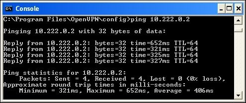
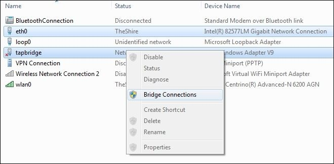
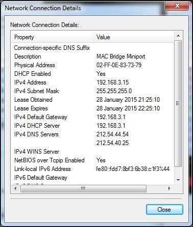
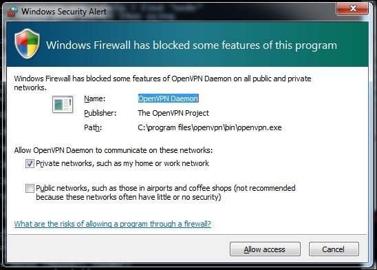
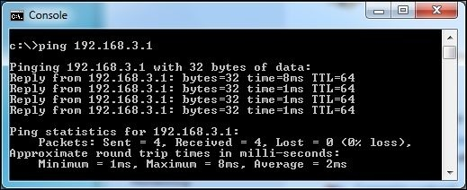
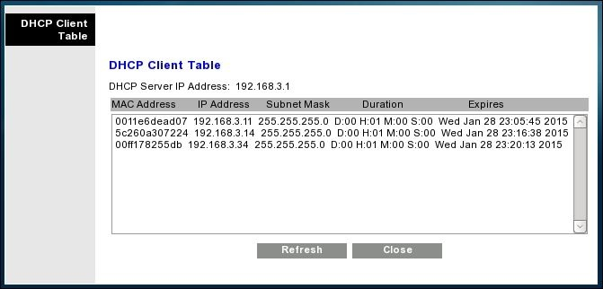
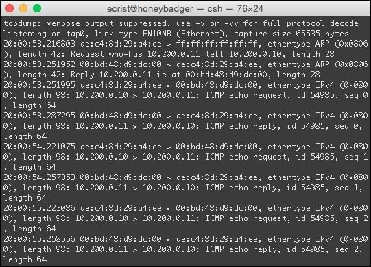
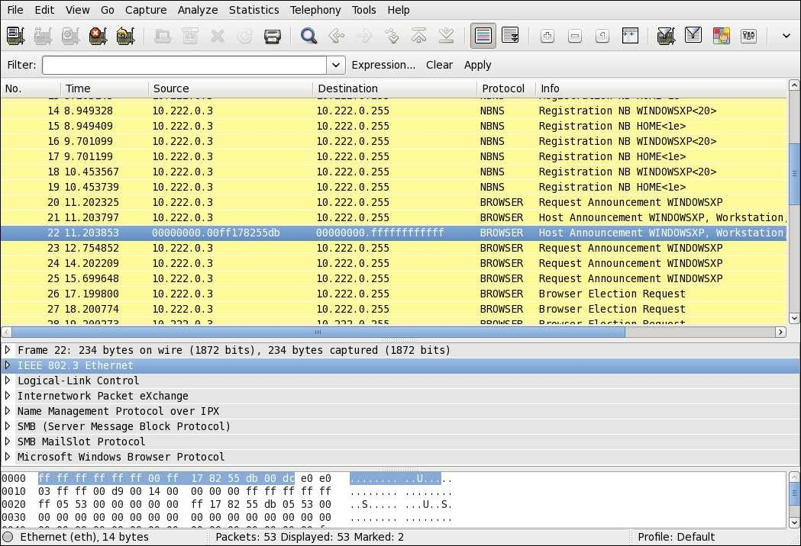

# Глава 6. "Режим клиент/сервер" с tap-устройствами

_Другая_ модель развертывания для OpenVPN является - один сервер с несколькими удаленными клиентами, способных к маршрутизации трафика Ethernet. Мы называем эту модель развертывания _режимом клиент-сервер с tap-устройствами_.

Основное различие между режимами tun и tap заключается в типе используемого адаптера. tap-адаптер обеспечивает полностью виртуальный интерфейс Ethernet (уровень 2), в то время как адаптер tun рассматривается большинством операционных систем как двухточечный (уровень 3).

Компьютеры, подключенные с использованием (виртуальных) адаптеров Ethernet, могут образовывать единый широковещательный домен, который необходим для определенных приложений. С двухточечными адаптерами это невозможно. Также обратите внимание, что не все операционные системы поддерживают tap-адаптеры. Например, iOS и Android поддерживают только tun-устройства.

В этой главе мы начнем с базовой настройки клиент-сервер, которая очень похожа на базовую настройку, описанную в [Главе 4](chapter-04.md), _Режим клиент-сервер с tun-устройствами_. Однако существуют тонкие различия, которые будут обсуждаться на нескольких примерах. Кроме того, режим tap включает настройку мостового соединения, при котором обычный сетевой адаптер соединяется с виртуальным tap-адаптером. Эта тема будет подробно обсуждаться как для операционных систем Linux, так и для Windows.

В этой главе будут рассмотрены следующие темы:

* Базовая настройка
* Включение клиент-клиентского трафика с использованием `pf`
* Bridging
* Соединение в Linux
* Соединение в Windows
* Использование внешнего DHCP-сервера
* Проверка широковещательного и не IP-трафика
* Сравнение режима Tun с режимом Tap

## Базовая настройка

Базовая настройка OpenVPN в режиме tap практически такая же, как и в режиме tun. В режиме tap мы используем следующую строку в файле конфигурации сервера:

```
dev tap
```

В режиме tun мы используем следующие строки:

```
dev tun
topology subnet
```

Опция `topology subnet` не требуется, но представляет схему сетевой адресации, которая является более разумной и будет использоваться по умолчанию в будущей версии OpenVPN.

Для полноты картины сначала создадим файл конфигурации сервера:

```
proto udp
port 1194
dev tap
server 10.222.0.0 255.255.255.0

persist-key
persist-tun
keepalive 10 60

remote-cert-tls client
tls-auth  /etc/openvpn/movpn/ta.key 0
dh        /etc/openvpn/movpn/dh2048.pem
ca        /etc/openvpn/movpn/movpn-ca.crt
cert      /etc/openvpn/movpn/server.crt
key       /etc/openvpn/movpn/server.key

user nobody
group nobody

verb 3
daemon
log-append /var/log/openvpn.log
```

Мы будем использовать этот основной файл конфигурации сервера в режиме tap в этой главе и других. Сохраните его как `tap-udp-server.conf`, чтобы мы могли использовать его позже.

---

**Заметка**

Параметр `topology subnet` был удален, поскольку параметр `topology` является параметром конфигурации, специфичным для tun. В режиме tap сервер всегда раздает каждому клиенту по одному IP-адресу с соответствующей маской сети.

---

Точно так же мы создаем файл конфигурации клиента, который снова почти идентичен файлу `basic-udp-client.conf` из [главы 4](chapter-04.md), _Режим клиент/сервер с устройствами tun_:

```
proto udp
port 1194
dev tap

client
remote openvpnserver.example.com
nobind

remote-cert-tls server
tls-auth  /etc/openvpn/movpn/ta.key 1
ca        /etc/openvpn/movpn/movpn-ca.crt
cert      /etc/openvpn/movpn/client1.crt
key       /etc/openvpn/movpn/client1.key
```

Сохраните этот файл как `tap-udp-client.conf`. Аналогично, для клиентов Windows создайте файл конфигурации `tap-udp-client.ovpn`.

Запустите сервер OpenVPN и подключите клиент, используя эти файлы конфигурации. Журнал соединений на стороне сервера покажет некоторые тонкие различия по сравнению с настройкой в режиме tun, которые выделены в следующем разделе:

```
OpenVPN 2.3.6 x86_64-redhat-linux-gnu [SSL (OpenSSL)] [LZO] [EPOLL]
[PKCS11] [MH] [IPv6] built on Dec 2 2014
library versions: OpenSSL 1.0.1e-fips 11 Feb 2013, LZO 2.03
[…]
TUN/TAP device tap0 opened
TUN/TAP TX queue length set to 100
do_ifconfig, tt->ipv6=0, tt->did_ifconfig_ipv6_setup=0
sbinip link set dev tap0 up mtu 1500
sbinip addr add dev tap0 10.222.0.1/24 broadcast 10.222.0.255
GID set to nobody
UID set to nobody
UDPv4 link local (bound): [undef]
UDPv4 link remote: [undef]

MULTI: multi_init called, r=256 v=256
IFCONFIG POOL: base=10.222.0.2 size=253, ipv6=0
Initialization Sequence Completed
CLIENT_IP:60728 TLS: Initial packet from [AF_INET]CLIENT_IP:60728,
sid=d4d7f1fd 988e4ff3
[…]
client1/CLIENT_IP:60728 PUSH: Received control message:
'PUSH_REQUEST'
client1/CLIENT_IP:60728 SENT CONTROL [client1]: 'PUSH_REPLY,routegateway 10.222.0.1,ping 10,ping-restart 60,ifconfig 10.222.0.2
255.255.255.0' (status=1)
client1/CLIENT_IP:60728 MULTI: Learn: 8e:66:e4:43:35:a1 ->
client1/CLIENT_IP:60728
```

Последняя строка журнала подключения к серверу - самая интересная: строка `MULTI: Learn` показывает, что сервер теперь использует MAC-адрес удаленного клиента, чтобы отличать его от других клиентов, тогда как в режиме tun он может полагаться исключительно на IP-адрес, назначенный клиенту. Это необходимо, так как клиент на основе tap может также отправлять не-IP трафик, в котором не используется IP-адрес.

## Включение клиент-клиентского трафика

Когда к серверу подключено несколько клиентов виртуальной частной сети (VPN) - им не разрешается обмениваться трафиком. Это верно как для режима tap, так и для режима tun. Чтобы включить трафик между клиентами, есть два варианта:

* Использование параметра конфигурации `client-to-client`. Он позволяет OpenVPN обрабатывать трафик клиент-клиент внутри системы, минуя таблицы системной маршрутизации, а также правила системного брандмауэра/iptables.
* Использование системной таблицы маршрутизации и правил брандмауэра/iptables для отправки трафика от одного клиента другому и обратно.

Первый вариант - самый быстрый как с точки зрения конфигурации, так и с точки зрения производительности. Если нет ограничений на трафик между VPN-клиентами - добавьте строку `client-to-client` в файл конфигурации `tap-udp-server.conf`, сохраните его как `movpn-06-01-server.conf` и перезапустите сервер OpenVPN, используя этот файл конфигурации:

```
$ openvpn --config movpn-06-01-server.conf
```

Переподключите VPN-клиентов. Первому клиенту назначен IP-адрес 10.222.0.2, а второму - 10.222.0.3. Теперь клиенты могут связаться друг с другом:



Высокая задержка (то есть время проверки связи более 300 мс) на предыдущем снимке экрана немедленно показывает один из недостатков использования трафика клиент-клиент по VPN. Весь трафик проходит через сервер OpenVPN, таким образом, пинг от client1 к client2 занимает больше времени:

1.  Сообщение запроса ping отправляется с `client1` на сервер OpenVPN.
2.  Сервер OpenVPN пересылает сообщение на `client2`.
3.  `client2` отправляет обратно ответное сообщение ping снова на сервер.
4.  Сервер OpenVPN пересылает ответ ping обратно на `client1`.

Если клиенты VPN подключены через сеть с высокой латентностью, то использование VPN модели клиент-сервер увеличит задержку при отправке трафика между клиентами. OpenVPN - это такая же модель VPN клиент-сервер как и большинство доступных коммерческих решений VPN. Существуют некоторые одноранговые VPN-решения, но они выходят за рамки этой книги.

### Фильтрация трафика между клиентами

Недостатком опции `client-to-client` является отсутствие фильтрации. Когда эта опция добавлена, _весь_ трафик между _всеми_ клиентами разрешен в обход правил системного брандмауэра/iptables.

Вторым способом обеспечения прохождения трафика между клиентами является использование таблиц маршрутизации системы. В режиме tun это сделать довольно просто, но немного сложнее при использовании режима tap. Когда `client1` желает связаться с `client2`, он сначала должен знать MAC (аппаратный) адрес `client2` . Запрос ARP отправляется через адаптер tap клиента и достигает сервера OpenVPN. Серверный процесс OpenVPN перенаправляет ARP-запрос из своего собственного tap-адаптера и ожидает ответа. Однако ответ должен прийти от другого VPN-клиента, который подключен к тому же адаптеру. Таким образом - ARP-запрос должен быть отправлен обратно всем подключенным клиентам сервера OpenVPN. Обычно повторная выдача ARP-запроса не выполняется и трафик клиент-клиент терпит неудачу.

В современных ядрах Linux (2.6.34+ или в ядрах с опциями обратного переноса) для каждого интерфейса может быть установлен специальный флаг `proxy_arp_pvlan`. Этот флаг указывает ядру Linux повторно отправить ARP-запрос обратно с того же интерфейса, откуда он поступил. Именно этот флаг необходим для работы трафика клиент-клиент. Таким образом мы включаем трафик клиент-клиент в режиме tap, не используя опцию `client-to-client`, устанавливая этот флаг:

```
# echo 1 > /proc/sys/net/ipv4/conf/tap0/proxy_arp_pvlan
```

---

**Заметка**

Этот системный флаг можно установить только после настройки адаптера tap0. Адаптер tap может быть создан до запуска OpenVPN (см. Раздел _Мостовое соединение в Linux_) или флаг может быть установлен после запуска OpenVPN. В этом случае, он может быть установлен автоматически с использованием скрипта, как описано в [Главе 7](chapter-07.md), _Скрипты и плагины_.

Когда `client1` хочет связаться с `client2` - поток сетевого трафика с этим установленным флагом выглядит следующим образом:

1. `client1` отправляет запрос ARP из своего tap-адаптера.
2. Сервер OpenVPN получает ARP-запрос и перенаправляет его из собственного адаптера tap0.
3. ARP-запрос проходит через системную маршрутизацию и таблицу пересылки iptables.
4. Если запрос разрешен - он отправляется всем сетевым интерфейсам на сервере OpenVPN, включая адаптер tap0, откуда был отправлен. Последнее вызвано флагом `proxy_arp_pvlan`.
5. OpenVPN получает ARP-запрос и перенаправляет его всем подключенным клиентам OpenVPN.
6. `client2` получает запрос и отвечает. ARP-ответ теперь отправляется обратно на сервер OpenVPN.
7. Сервер OpenVPN пересылает ARP-ответ `client1`.
8. `client1` теперь знает, где найти `client2` и может отправлять сетевой трафик `client2`.

Второй шаг позволяет нам отфильтровать трафик между разными клиентами. Правила фильтрации (например, с использованием `iptables`) могут быть добавлены для разрешения только определенных типов трафика или только трафика между специальными клиентами. Например, следующее правило `iptables` блокирует трафик между первым и вторым клиентом OpenVPN:

```
# iptables -I FORWARD -i tap0 -o tap0 \
-s 10.222.0.2 -d 10.222.0.3 -j DROP
```

Обратите внимание, что блокируя трафик в одном направлении, оба клиента не смогут связаться друг с другом. Для однонаправленной блокировки требуются более продвинутые правила `iptables`.

---

**Заметка**

Нет эквивалента для флага `proxy_arp_pvlan` в операционных системах Windows или Mac OS, но это неточно.

---

#### Недостаток метода proxy_arp_pvlan

Основным недостатком использования этого флага ядра является то, что он не превращает VPN в один широковещательный домен Ethernet. С флагом `proxy_arp_pvlan` клиенты VPN могут связываться друг с другом с помощью ARP-сообщений. Однако они не будут получать широковещательный трафик, приходящий от других клиентов. Когда используется опция `client-to-client` - все подключенные VPN-клиенты автоматически получают широковещательные сообщения друг друга, но фильтрация трафика сложнее (как мы увидим в следующем разделе).

#### Фильтрация трафика с использованием фильтра OpenVPN pf

Второй метод фильтрации трафика от клиентов OpenVPN - это использование встроенного фильтра OpenVPN `pf`. Этот фильтр также полностью поддерживается в OpenVPN Access Server - коммерческом предложении от OpenVPN Technologies Inc. Поддержка фильтра `pf` является элементарной по сравнению с большинством брандмауэров, но она полностью функциональна и доступна на всех платформах. Теперь мы пройдемся по шагам для использования этого фильтра в свободной версии OpenVPN. Этот пример приведен только в качестве доказательства концепции; станет ясно, что для обслуживания на уровне продакшена необходим другой подход и/или инструмент.

Чтобы использовать фильтр `pf` - должен использоваться интерфейс управления OpenVPN. Это достигается с помощью следующего файла конфигурации:

```
proto udp
port 1194
dev tap
server 10.222.0.0 255.255.255.0

persist-key
persist-tun
keepalive 10 60

remote-cert-tls client
tls-auth  /etc/openvpn/movpn/ta.key 0
dh        /etc/openvpn/movpn/dh2048.pem
ca        /etc/openvpn/movpn/movpn-ca.crt
cert      /etc/openvpn/movpn/server.crt
key       /etc/openvpn/movpn/server.key

user nobody
group nobody

verb 3
daemon
log-append /var/log/openvpn.log

client-to-client
management 127.0.0.1 12000 stdin
management-client-auth
management-client-pf
```

Сохраните этот файл как `movpn-06-02-server.conf` и запустите сервер OpenVPN. Сервер OpenVPN запросит (новый) пароль управления. Этот пароль будет использоваться для аутентификации всех соединений с интерфейсом управления; VPN-клиенты аутентифицируются отдельно. Параметр `management-client-pf` требует чтобы также был установлен параметр `management-client-auth`. Недостатком же является то, что теперь каждый клиент должен предоставить (поддельные) имя пользователя и пароль и каждому клиенту должен быть предоставлен доступ на стороне сервера с использованием интерфейса управления.

Файл конфигурации клиента теперь становится:

```
proto udp
port 1194
dev tap

client
remote openvpnserver.example.com
nobind

remote-cert-tls server
tls-auth  /etc/openvpn/movpn/ta.key 1
ca        /etc/openvpn/movpn/movpn-ca.crt
cert      /etc/openvpn/movpn/client1.crt
key       /etc/openvpn/movpn/client1.key

auth-user-pass
```

Сохраните его как `movpn-06-02-client.conf` (или `movpn-06-02-client.ovpn` для Windows).

На стороне сервера сначала запустите интерфейс управления, используя `telnet`:

```
# telnet 127.0.0.1 12000
Trying 127.0.0.1...
Connected to 127.0.0.1.
Escape character is '^]'.
ENTER PASSWORD:
SUCCESS: password is correct
>INFO:OpenVPN Management Interface Version 1 -- type 'help' for more info
```

Затем запустите клиент OpenVPN. Соединение с сервером не будет завершено пока клиенту не будет предоставлен доступ через интерфейс управления. В интерфейсе управления вы увидите это:

```
>CLIENT:CONNECT,0,0
>CLIENT:ENV,n_clients=0
>CLIENT:ENV,IV_VER=2.3.6
>CLIENT:ENV,IV_PLAT=linux
>CLIENT:ENV,IV_PROTO=2
[…]
```

После получения всех строк `>CLIENT` авторизуйте клиента для подключения. Для этого требуются **идентификатор клиента (CID)** и **идентификатор ключа (KID)**. Это параметры в самых первых строках `>CLIENT` при подключении клиента OpenVPN. В этом примере и CID, и KID равны `0`. Чтобы предоставить этот клиентский доступ, команда `client-auth-nt CID KID` должна быть введена в интерфейсе управления:

```
client-auth-nt 0 0
SUCCESS: client-auth command succeeded
>CLIENT:ESTABLISHED,0CLIENT:CONNECT,0,0
```

Первый клиент OpenVPN теперь имеет доступ. Теперь мы можем применить правила контроля доступа к этому клиенту, используя команду `client-pf CID`. Это многострочная команда. После первой строки мы сначала указываем подсети, к которым этому клиенту разрешен доступ:

```
[SUBNETS ACCEPT]
-10.0.0.0/8
```

Мы предоставляем клиенту доступ ко всем подсетям, _кроме_ 10.0.0.0/8.

Далее мы указываем, к каким клиентам этот клиент может обратиться:

```
[CLIENTS ACCEPT]
-client3
```

Мы разрешаем клиенту связываться со всеми другими клиентами VPN, _кроме_ клиента с именем сертификата `/CN = client3`. С помощью двух операторов `END`, одного с квадратными скобками и одного - без, мы закрываем команду `client-pf`:

```
client-pf 0
[SUBNETS ACCEPT]
-10.0.0.0/8
[CLIENTS ACCEPT]
-client3
[END]
END
SUCCESS: client-pf command succeeded
```

Этот клиент OpenVPN теперь сможет обращаться ко всем подсетям на стороне сервера, кроме 10.0.0.0/8, и может связываться со всеми другими клиентами OpenVPN, кроме `client3`.

У этого подхода много недостатков, но он работает на всех платформах. Основными недостатками являются следующие:

* Каждый клиент должен предоставить поддельное имя_пользователя/пароль
* Каждый клиент должен быть аутентифицирован с использованием интерфейса управления
* Для каждого клиента должен быть установлен фильтр `pf`
* Интерфейс управления в настоящее время не имеет команд для просмотра текущих фильтров

В настоящее время для свободной версии OpenVPN нет инструмента для отправки этих команд в интерфейс управления. Однако коммерческое программное обеспечение OpenVPN Access Server обеспечивает необходимый механизм для применения правил фильтрации.

## Использование устройства tap (мост)

Особый вариант использования конфигурации на основе tap - мостовое соединение. Термин мостовое соединение применяется к функции операционной системы для соединения двух сетевых адаптеров вместе. Когда два (или более) адаптера соединены мостом - весь трафик Ethernet, полученный на одном из адаптеров, перенаправляется на все остальные адаптеры, которые являются частью этого моста. Это позволяет объединить (соединить) два сегмента сети вместе и создать впечатление что это один широковещательный домен Ethernet. Типичные случаи использования мостов:

* Клиенты VPN должны быть полностью и прозрачно интегрированы в LAN на стороне сервера. Обратите внимание, что тот же эффект часто может быть достигнут с помощью настройки `proxy-arp`.
* Некоторые старые компьютерные игры разрешают многопользовательские игры только тогда, когда все компьютеры являются частью одного и того же широковещательного домена.
* Некоторые устаревшие сетевые протоколы, особенно оригинальный протокол Microsoft NetBIOS (не основанный на TCP/IP), не работают должным образом на сетевых маршрутизаторах или даже предполагают полностью «плоское» сетевое пространство со всеми клиентами, подключенными напрямую.

Мостовые соединения также имеют недостатки, в частности, снижение производительности. Весь сетевой трафик, поступающий на один из мостовых интерфейсов, дублируется на все остальные интерфейсы. Из-за этого довольно легко перегрузить мост многоадресным или широковещательным трафиком. В особенности при настройке VPN с клиентами, использующими соединения с высокой задержкой или низкой пропускной способностью (например, работники на выезде) - эта потеря производительности может быстро сделать настройку OpenVPN непригодной для использования.

Следует также отметить, что мостовая настройка часто не требуется. Благодаря современным операционным системам и протоколам совместного доступа к файлам настройка на основе tun может достичь тех же результатов, прилагая меньше усилий и повышая производительность.

К сожалению, до сих пор распространено заблуждение что для использования общего доступа к файлам Windows через установку OpenVPN необходимо использовать мосты. В разделе _Включение общего доступа к файлам через VPN_ в [Главе 5](chapter-05.md), _Расширенные сценарии развертывания в туннельном режиме_, подробное объяснение дается о том, как достичь общего доступа к файлам с помощью tun-установки и сервера WINS.

В некоторых случаях мостовая установка остается желательной или необходимой. Теперь мы покажем, как настроить мостовую конфигурацию OpenVPN на платформах Linux и Windows.

### Соединение в Linux

Рассмотрим следующую схему сети:


На стороне сервера используется сетевой мост между адаптером LAN `eth0` и виртуальным адаптером OpenVPN tap. В Linux это достигается созданием адаптера tap до запуска OpenVPN. Для этого должен быть установлен системный пакет `bridge-utils`. Шаги следующие:

1. Сначала мы создаем скрипт для запуска сетевого моста:

```
#!/bin/bash
br="br0"
tap="tap0"
eth="eth0"
br_ip="192.168.122.1"
br_netmask="255.255.255.0"
br_broadcast="192.168.122.255"
# Create the tap adapter
openvpn --mktun --dev $tap
# Create the bridge and add interfaces
brctl addbr $br
brctl addif $br $eth
brctl addif $br $tap
# Configure the bridge
ifconfig $tap 0.0.0.0 promisc up
ifconfig $eth 0.0.0.0 promisc up
ifconfig $br $br_ip netmask $br_netmask broadcast $br_broadcast
```

2.  Сохраните его как `movpn-bridge-start` и убедитесь, что он исполняется с помощью следующей команды:

```
# chmod 755 movpn-bridge-start
```

3. Затем запустите мост, используя следующую команду:

```
# ./movpn-bridge-start
Mon Jan 5 18:40:02 2015 TUN/TAP device tap0 opened
Mon Jan 5 18:40:02 2015 Persist state set to: ON
```

4. Теперь мы создаем файл конфигурации для мостовых настроек, используя следующие команды:

```
tls-server
proto udp
port 1194

dev tap0 ## the '0' is extremely important

server-bridge 192.168.122.1 255.255.255.0 192.168.122.128
192.168.122.200

remote-cert-tls client
tls-auth  /etc/openvpn/movpn/ta.key 0
dh        /etc/openvpn/movpn/dh2048.pem
ca        /etc/openvpn/movpn/movpn-ca.crt
cert      /etc/openvpn/movpn/server.crt
key       /etc/openvpn/movpn/server.key

persist-key
persist-tun
keepalive 10 60

user nobody
group nobody

verb 3
daemon
log-append /var/log/openvpn.log
```

5. Сохраните его как `movpn-06-03-server.conf`. Аргументами к `server-bridge` являются сетевой шлюз, маска подсети, начало пула и конец пула. Адреса пула - это адреса, которые могут быть назначены клиентам.

---

**Заметка**

Строка `dev tap0` в предыдущем примере имеет решающее значение для работы мостового соединения. Мы создали адаптер tap для моста до запуска OpenVPN. Чтобы использовать этот адаптер - мы должны явно указать имя адаптера. В противном случае OpenVPN создаст новый адаптер без моста при запуске.

---

6. Запустите сервер OpenVPN и подключите клиента с помощью файла конфигурации `tap-udp-client.conf`, созданного ранее в этой главе. На клиенте Linux в журнале подключений будет показано следующее:

```
TUN/TAP device tap0 opened
do_ifconfig, tt->ipv6=0, tt->did_ifconfig_ipv6_setup=0
/sbin/ip link set dev tap0 up mtu 1500
/sbin/ip addr add dev tap0 192.168.122.128/24 broadcast
192.168.122.255
Initialization Sequence Completed
```

Клиенту назначается первый адрес - `192.168.122.128` из пула доступных адресов.

7. Наконец, мы проверяем, что можем достичь хоста в локальной сети на стороне сервера:

```
[client]$ ping -c 4 192.168.122.246
PING 192.168.122.246 (192.168.122.246) 56(84) bytes of data.
64 bytes from 192.168.122.246: icmp_req=1 ttl=64 time=287 ms
64 bytes from 192.168.122.246: icmp_req=2 ttl=64 time=289 ms
64 bytes from 192.168.122.246: icmp_req=3 ttl=64 time=285 ms
64 bytes from 192.168.122.246: icmp_req=4 ttl=64 time=287 ms
--- 192.168.122.246 ping statistics ---
4 packets transmitted, 4 received, 0% packet loss, time 3003ms
rtt min/avg/max/mdev = 285.397/287.496/289.568/1.570 ms
```

#### Разрыв моста

Когда процесс сервера OpenVPN останавливается, сетевой мост также не отключается автоматически. Поскольку мост был создан до запуска самого OpenVPN, он сохраняется до тех пор, пока не будет разорван вручную. Следующие команды останавливают и удаляют мост, созданный командой `movpn-start-bridge`:

```
# ifconfig br0 down
# brctl delif br0 eth0
# brctl delif br0 tap0
# brctl delbr br0
# openvpn --rmtun --dev tap0
```

### Соединение в Windows

Рассмотрим следующую схему сети:


Единственная разница между предыдущим сетевым макетом и этим - выбор используемых IP-адресов.

В Windows адаптер OpenVPN TAP-Win устанавливается при установке самого OpenVPN. Обычно имя для адаптера TAP-Win назначается операционной системой и будет примерно таким же, как для Подключение по локальной сети 4. Аналогично имя адаптера Ethernet, к которому подключена локальная сеть, также будет иметь имя подобное Подключение по локальной сети 2.

Для ясности (и некоторого здравого смысла) мы хотим переименовать интерфейс VPN (TAP):

1. Сначала мы идем в **Центр управления сетями и общим доступом**, а затем **Измененеие параметров адаптера**.
2. Переименуйте адаптер TAP-Win как `tapbridge` щелкнув по нему правой кнопкой мыши и выбрав **Переименовать**. На используемом тестовом компьютере адаптер Ethernet, подключенный к локальной сети, был переименован в eth0. В столбце **Состояние** укажите сетевую группу, к которой принадлежит интерфейс. В нашем случае он принадлежит **TheShire**.
3. Выберите два адаптера, которые необходимо соединить, нажав клавишу **Ctrl** и щелкнув по каждому адаптеру, затем щелкнув правой кнопкой мыши и выбрав **Настройка моста**.



4. Убедитесь, что вновь созданный **Сетевой мост** является частью той же сети, что и исходный адаптер **eth0**. Вы также можете видеть что оригинальный сетевой адаптер теперь имеет метку **Мост** в поле **Состояние**:


5. Нет необходимости настраивать статический IP-адрес для моста. **Сетевой мост** имеет свой собственный (виртуальный) MAC-адрес (или **Физический адрес** на следующем скриншоте) и, следовательно, ему присваивается свой собственный IP-адрес DHCP-сервером в локальной сети на стороне сервера:



6. Создайте файл конфигурации сервера OpenVPN с помощью текстового редактора или Блокнота:

```
tls-server
proto udp
port 1194

dev tap
dev-node tapbridge ## == the name of the TAP-Win adapter

server-bridge 192.168.3.15 255.255.255.0 192.168.3.128
192.168.3.250

remote-cert-tls client
tls-auth  "c://program files/openvpn/config/ta.key" 0
dh        "c://program files/openvpn/config/dh2048.pem"
ca        "c://program files/openvpn/config/movpn-ca.crt"
cert      "c://program files/openvpn/config/server.crt"
key       "c://program files/openvpn/config/server.key"

persist-key
persist-tun
keepalive 10 60

verb 3
```

Сохраните файл конфигурации как `movpn-06-04-server.ovpn` в каталоге конфигурации OpenVPN (обычно это `C:\Program Files\OpenVPN\config`).

---

**Заметка**

Файл конфигурации сервера для версии OpenVPN для Windows аналогичен файлу конфигурации для Linux. Основными отличиями являются полные пути к файлам сертификатов и ключей, а также способ указания адаптера TAP-WIN с помощью ключевых слов `dev` и `dev-node`. Также обратите внимание, что параметры `user/group` и `daemon/logging` были удалены.

---

7. Запустите сервер OpenVPN (с повышенными привилегиями):

```
C:> cd \program files\openvpn\config
C:> ..\bin\openvpn --config movpn-06-04-server.ovpn
```

Обратите внимание, что версия OpenVPN для Windows в командной строке выглядит и ведет себя почти так же, как версия для командной строки Linux.

8. Брандмауэр Windows отобразит предупреждение безопасности, когда OpenVPN попытается настроить VPN. Нажмите **Разрешить доступ**, чтобы предоставить разрешение OpenVPN для настройки VPN, как показано на следующем снимке экрана:



9. Если мы вернемся к экрану **Настройки адаптера** теперь мы видим что и адаптер локальной сети **eth0** и TAP-Win адаптер **tapbridge** являются **Включен** и имеют статус **Мост**. Это показано на следующем снимке экрана:


10. Затем подключите клиент Windows с помощью файла конфигурации `tap-udp-client.ovpn`, созданного ранее в этой главе. Клиенту будет назначен первый адрес - `192.168.3.128` из пула доступных адресов.

11. Наконец, мы проверяем, что можем достичь хоста в локальной сети на стороне сервера:



12. На сервере нажмите функциональную клавишу _F4_ в командном окне для остановки процесса сервера OpenVPN. Для настройки производственного уровня желательно запускать и останавливать OpenVPN с помощью службы OpenVPN, которая устанавливается вместе с OpenVPN.

## Использование внешнего DHCP-сервера

В мостовой конфигурации можно еще больше интегрировать клиентов в серверную сеть. В большинстве сетей DHCP-сервер используется для назначения IP-адресов. Обычно OpenVPN назначает IP-адреса своим клиентам с помощью одной из следующих команд:

```
server 10.200.0.0 255.255.255.0
```

Или с помощью следующей команды:

```
server-bridge 192.168.3.15 255.255.255.0 192.168.3.128
192.168.3.250
```

Также можно использовать внешний DHCP-сервер для назначения адресов клиентам OpenVPN. Для этого просто удалите спецификацию любых диапазонов IP-адресов после параметра `server-bridge`, как показано в следующем (ориентированном на Linux) файле конфигурации:

```
tls-server
proto udp
port 1194
dev tap0 ## the '0' is extremely important
server-bridge
remote-cert-tls client
tls-auth etcopenvpn/movpn/ta.key 0
dh etcopenvpn/movpn/dh2048.pem
ca etcopenvpn/movpn/movpn-ca.crt
cert etcopenvpn/movpn/server.crt
key etcopenvpn/movpn/server.key
persist-key
persist-tun
keepalive 10 60
user nobody
group nobody
verb 3
daemon
log-append varlog/openvpn.log
```

Сохраните его как `movpn-06-05-server.conf` и запустите сервер OpenVPN.

Когда клиент подключается и запрашивает IP-адрес с помощью DHCP - запрос будет перенаправлен на сервер DHCP в локальной сети на стороне сервера. DHCP-сервер назначает адрес, который отправляется обратно клиенту через сервер OpenVPN.

На клиенте OpenVPN это можно проверить, посмотрев IP-адрес соединения `vpn0`:


Чтобы убедиться, что этот адрес был назначен сервером DHCP на стороне сервера, мы проверяем таблицу клиентов DHCP на сервере DHCP:



Третья запись в **DHCP Client Table** на предыдущем снимке экрана содержит **MAC Address** адаптера TAP-Win клиента OpenVPN. Это доказывает, что серверный DHCP-сервер назначил адрес клиенту OpenVPN.

## Проверка широковещательного и не IP-трафика

Инструменты tcpdump и wireshark полезны для устранения неполадок в "почти работающей" настройке OpenVPN. Wireshark доступен для Linux, Mac OS X и Windows. Его можно использовать как инструмент командной строки, но чаще всего используется версия на основе графического интерфейса. На большинстве Unix/Linux-платформ также доступен инструмент командной строки tcpdump.

Теперь мы будем использовать tcpdump и wireshark для просмотра потока пакетов через установку VPN на основе tap.

### Протокол разрешения адресов трафика

Одним из самых основных типов трафика Ethernet, присутствующего во всех сетях, является трафик **протокола разрешения адресов (ARP)**. ARP является ярким примером протокола Ethernet, который не передается по двухточечным каналам связи (например, при настройке OpenVPN на основе туннеля). Физический уровень (уровень 1) обычно представляет собой электрическую или оптическую связь между системами. В случае VPN - туннель занимает место этого физического соединения. Следующим шагом в модели OSI является уровень Ethernet (уровень 2). Протокол ARP часто используется для обнаружения других систем на этом уровне.

---

**Подсказка**

Ethernet является сетевым протоколом уровня 2, а точка-точка - сетевым протоколом уровня 3. Различные уровни протокола определяются моделью **Open Systems Interconnection (OSI)** (https://ru.wikipedia.org/wiki/Сетевая_модель_OSI).

---

Чтобы наблюдать за потоком ARP-трафика мы сначала запускаем сервер OpenVPN, используя ранее созданный файл конфигурации `movpn-06-01-server.conf`. Затем подключаем двух клиентов Linux к серверу. После того, как все соединения были успешно установлены, мы запускаем `tcpdump` на одном из клиентов:

```
# tcpdump -nnel -i tap0
```

Теперь мы отправляем один пакет `ping` от одного клиента другому и смотрим на вывод `tcpdump`:



На снимке экрана показан трафик ARP между `client1` (в данном случае 10.200.0.10) и `client2` (10.200.0.11).

* Первый пакет в выводе выше от клиента, с которого был инициирован `ping`. Клиент должен знать Ethernet MAC-адрес компьютера, который мы проверяем, и, следовательно, он отправляет запрос ARP.
* Поскольку мы указали `client-to-client` в файле конфигурации сервера `movpn-06-01-server.conf`, ARP-запрос пересылается всем подключенным клиентам, и второй клиент OpenVPN отвечает своим MAC-адресом.
* Второй пакет - это ответ от второго клиента, указывающий его собственный MAC-адрес.
* Теперь, когда адрес известен, `client1` отправляет ping. Он отображается как `IPv4 ICMP echo request`.
* Ответ получен от второго клиента. Это четвертый пакет (IPv4 ICMP echo reply).

### Трафик NetBIOS

**Common Internet File Sharing (CIFS)** начинался как закрытый протокол NetBEUI. Поддержка совместного использования файлов и принтеров осуществлялась через протокол Novell **Internetwork Packet eXchange (IPX)**, а затем был добавлен протокол TCP/IP. В настоящее время протокол обмена файлами Windows развился и поддерживается только через TCP/IP. Поддержка устаревших файловых протоколов все еще присутствует в более старых версиях Windows и именно эту устаревшую поддержку мы будем использовать для запуска трафика не-IP.

Сначала мы устанавливаем и включаем транспортный протокол NWLink IPX/SPX на адаптере TAP-WIN. Затем мы подключаем клиента Windows к установке OpenVPN, которая была запущена с использованием файла конфигурации `movpn-06-01-server.conf`. В этой конфигурации включен `client-to-client`; таким образом, все подключенные клиенты должны видеть весь широковещательный трафик Ethernet, поступающий от этого клиента.

Когда клиент Windows успешно подключится к VPN-серверу, он начнет отправлять трафик для объявления своего имени и другой информации об обмене файлами Windows. Он попытается сделать это через TCP/IP, но также с использованием сообщений IPX.

Мы используем Wireshark на втором VPN-клиенте и отслеживаем трафик на интерфейсе tap. На следующем снимке экрана показано, что клиент Windows WINDOWSXP действительно отправляет широковещательный трафик NetBIOS через TCP/IP. Это записи с исходным адресом 10.222.0.3 и адресом назначения 10.222.0.255. Последний адрес является широковещательным адресом TCP/IP для настроенной нами VPN. Мы также видим, что трафик передается по протоколу IPX. Этот трафик выделен и выделен на скриншоте:



Широковещательные сообщения IPX являются широковещательными сообщениями _Ethernet_, но они не основаны на IP. Это показывает, что установка OpenVPN в стиле tap с `client-to-client` разделяет весь трафик Ethernet, включая широковещательный трафик между подключенными клиентами (и самим сервером OpenVPN).

## Сравнение режима tun с режимом tap

Как мы уже видели в этой главе, есть много сходств, но также есть и существенные различия между VPN в стиле tun и VPN в стиле tap. В этом разделе мы обсудим эти сходства и различия. Большинство различий проистекает из единственного факта что VPN в стиле tun является не широковещательной, а двухточечной IP-сетью, в то время как сеть в стиле tap обеспечивает полностью виртуальную, Ethernet-подобную сеть с поддержкой широковещания. Короче говоря, сеть в стиле tun обеспечивает сетевое подключение уровня 3, тогда как сеть в стиле tap обеспечивает практически все функциональные возможности сети уровня 2.

Особенно с опцией `topology subnet`, настройка на основе TUN напоминает установку без перемычек:

* Опция `server 10.200.0.0 255.255.255.0` устанавливает VPN с адресом сервера 10.200.0.1. Каждый клиент получит один адрес _из 24 IP-адресной адресации, начиная с 10.200.0.2_.
* Способ шифрования VPN-трафика и цифровой подписи (HMAC) идентичен.
* Большинство возможностей сценариев применимы к обоим типам VPN. Однако есть некоторые тонкие различия в параметрах для сценария `client-connect`.
* При правильной настройке конечный пользователь не будет испытывать различий между настройкой на основе tun и VPN-подключением на основе tap.

Эти различия, конечно, гораздо интереснее обсуждать. Некоторые различия очевидны, но есть и некоторые тонкие различия, которые могут оказать существенное влияние при настройке VPN.

### Слой 2 против слоя 3

В сети уровня 2 (т.е. в стиле tap) соседние клиенты могут связаться друг с другом, узная адрес соседа, используя широковещательные ARP-запросы. Широковещательные ARP-запросы позволяют клиентам обнаруживать MAC-адреса других клиентов. Это позволяет клиентам связываться друг с другом по протоколам IP и не-IP.

В сети уровня 3 (в стиле tun) клиенты могут связываться друг с другом только с помощью IP-адресов. MAC-адрес адаптера tun никогда не раскрывается другим VPN-клиентам и даже самому серверу OpenVPN. Из-за этого сетевой пакет уровня 3 немного короче, чем сетевой пакет уровня 2. При нормальных обстоятельствах более длинные сетевые пакеты уровня 2 не оказывают негативного влияния на производительность.

### Маршрутные различия и iroute

Когда особенно необходима маршрутизация от подсети к подсети между tun и tap есть некоторые существенные различия. В сети в стиле tun необходим файл конфигурации клиента с соответствующим оператором `iroute` чтобы позволить VPN-серверу получать доступ к клиентам, находящимся в локальной сети на стороне клиента. В качестве примера мы предполагаем, что подсеть 192.168.3.0/24 может быть достигнута через клиента OpenVPN с сертификатом `CN=client1`. На сервере OpenVPN мы добавили бы файл `client-config-dir` с именем `client1`, содержащий инструкцию:

```
iroute 192.168.3.0 255.255.255.0
```

И добавили бы системный маршрут в файл конфигурации сервера:

```
route 192.168.3.0 255.255.255.0
```

В настройке в стиле tap оператор `iroute` недопустим и будет просто игнорироваться сервером. Чтобы достичь подсети _за_ VPN-клиентом необходимо добавить системный маршрут на сервере OpenVPN, а шлюз должен указывать на VPN-IP-адрес клиента. Давайте предположим, что для `client1` из предыдущего примера назначен фиксированный IP-адрес. Это может быть достигнуто с помощью файла CCD:

```
ifconfig-push 10.200.0.99 255.255.255.0
```

В файле конфигурации сервера необходимо добавить маршрут, чтобы таблицы системной маршрутизации знали, что подсеть 192.168.3.0/24 может быть достигнута через клиента 10.200.0.99:

```
route 192.168.3.0 255.255.255.0 10.200.0.99
```

Это гораздо менее динамично, чем опция tun-style `route + iroute`.

### Фильтрация клиент-клиент

При настройке в стиле tun большая часть трафика может регистрироваться и фильтроваться с использованием правил брандмауэра или iptables. Фильтрация трафика между клиентами OpenVPN намного сложнее в настройке в режиме tap, как было показано ранее в этой главе.

### Трансляция трафика и "болтливость" сети

Сеть уровня 3 не позволяет передавать широковещательный трафик по ней. Это и преимущество и недостаток. Некоторые клиент-серверные приложения полагаются на использование широковещательного трафика для связи между сервером и клиентами. Для таких приложений требуется сеть в стиле tap.

Однако широковещательный трафик также имеет тенденцию засорять сети. Даже если на клиенте нет действий пользователя, операционная система будет непрерывно отправлять широковещательный трафик для обнаружения сетевых ресурсов, соседей и т.д. Особенно, когда используются такие протоколы как Universal Plug-and-Play или Apple Bonjour существует много скрытого широковещательного трафика. Для клиентов, подключенных к VPN через сеть с низкой пропускной способностью, это может иметь серьезные последствия для производительности.

### Мост

Ключевой особенностью сети в стиле tap является возможность создания мостов. Мостовое соединение невозможно в сети уровня 3.

В некоторых редких случаях эта функция абсолютно необходима, но при любой возможности следует избегать мостовой настройки. Основной причиной неиспользования мостовой настройки является негативное влияние на производительность. Как объяснялось ранее, в мостовой конфигурации весь трафик из локальной сети на стороне сервера перенаправляется через VPN всем клиентам и наоборот. Когда множество клиентов подключены к сетям с низкой пропускной способностью, это может привести к обходу всей сети как на стороне клиента, так и в локальной сети на стороне сервера. Когда клиенты в локальной сети на стороне сервера пытаются обнаружить доступные ресурсы в сети (например, общие файловые ресурсы или принтеры в сети на основе CIFS), вся сеть будет заполнена широковещательным трафиком. Клиенты локальной сети обычно ждут ответов от всех компьютеров, подключенных к сети, как локальной, так и VPN прежде чем предлагать доступ к общим сетевым ресурсам или принтерам. Это может быстро привести к недопустимому времени отклика сети в случае когда множество VPN-клиентов подключается и отключается.

## Резюме

В этой главе мы рассмотрели возможности установки на основе отводов в качестве альтернативной модели развертывания OpenVPN. Мы обсудили примеры, подчеркивающие как особенности, так и недостатки такой установки. Особое внимание было уделено настройке с использованием моста, так как существует несколько распространенных заблуждений относительно режима с использованием моста, о чем говорится на форумах поддержки OpenVPN в Интернете.

Мы также увидели, что расширенные функции управления, такие как фильтрация трафика между клиентами OpenVPN, гораздо сложнее реализовать в режиме касания по сравнению с режимом настройки.

В следующей главе мы увидим, как мы можем использовать скрипты и плагины, чтобы влиять на то, как сервер OpenVPN назначает IP-адрес клиенту, а также на многие другие функции. Скрипты и плагины могут использоваться как в режиме касания, так и в режиме настройки.
